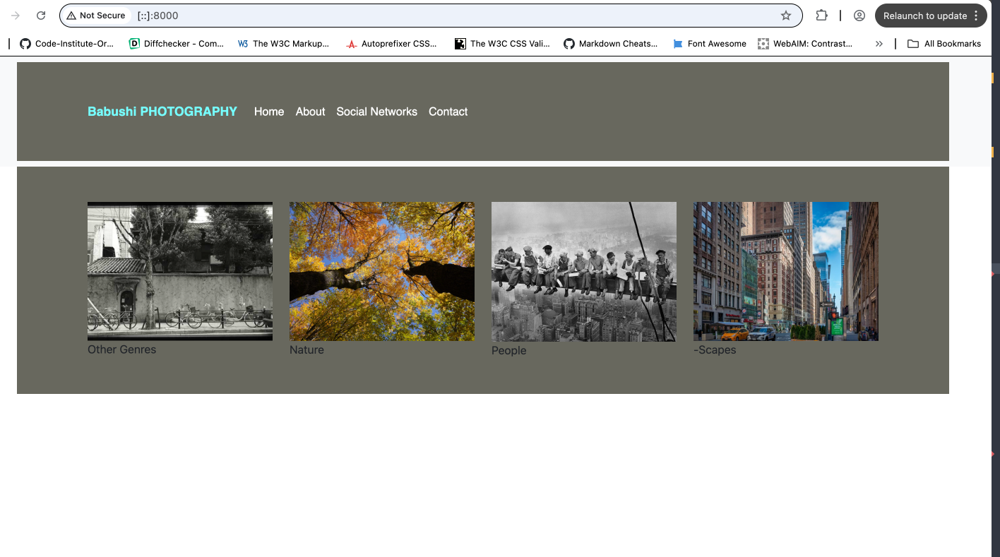

# Babushi Photography

## Index – Table of Contents
* [Introduction](#Introduction)
* [User Experience (UX)](#user-experience-ux) 
 [Design of Website](#design-of-website)
* [Wireframes](#wireframes)
* [Fonts and Colour Scheme](#fonts-and-colour-scheme)
* [Technologies Used](#technologies-used)
* [Testing](#testing)
* [Deployment](#deployment)
* [Bugs](#bugs)
* [Credits](#credits)

# Introduction

This is a photography website that specialises in artistic photographs covering several genres: nature, people, -scapes (landscapes, streetscapes etc.), as well as a fourth genres for photographs which don’t precisely fall into any of the other three categories.

The purpose of the website is to give photographers and artists access to more niche photographs not available in the more commonly seen commercial photography websites, and photographs which are more often found in specialist books, journals and galleries.

The website presents the latest photographs in each genre, each given an image number which can be used for viewers to obtain further information about the photograph, such as its background, the photographer, and if it is open for sale. Photographers, agents and others can use this as a means of establish contact with other photographers via the website, and so it forms a hub for people of similar interests and need to get together and for networking.

## User Experience (UX)

-   ### User stories

    -   #### A. First Time Visitor Goals

        1. As a First Time Visitor, I want to easily understand the main purpose of the site and quickly learn what it has to offer.
        2. As a First Time Visitor, I want navigation through the site to be intuitive.
        3. As a First Time Visitor, I want photographs to be in clearly groupings so I may easily find what I seek.
        4. 4. As a First Time Visitor, I want the photographs to be clear and dominate the screen rather than other information.
        5. As a First Time Visitor, I want to be able to find the relevant contact information with little effort.

    -   #### B. Returning Visitor Goals

        1. As a Returning Visitor, I want my previous visit to have been educational enough so that I may use the site as if I have already used it for a long time.
        2. As a Returning Visitor, I want to be able to easily check if new photographs have come in.
        3. As a Returning Visitor, I want to have an easy means of referring to individual photographs in case I have questions and queries regarding them.
      

    -   #### C. Website Owner Business Goals

	   1. As the website owner, I would like my website to be minimalist as is commonly found in this genre of photography, and yet appealing.
        2. As the website owner, I want the minimalism of the site to serve two purposes, both aesthetic and intuitive through its minimalism, so visitors can enjoy the site both through visual design and ease of navigation.
	   3. As the website owner, I want to introduce our photographic art and the type of thing we have to offer to as many people as possible so that this unique service will get as much traction as possible.

# Design of the website

The design of the website aims to be minimalist. This is not only inline with the typical aesthetics of this genre, but also puts the focus on the photographs themselves.

The priorities here are the photographs. Though some photographs may be available for sale, this is at the discretion of each individual photographer. The site, as much as anything else aims to bring like minded photographers, artists and laypersons together. It is more of an artistic and intellectual site than a commercial one. All of this being considered, contact information has been limited to two email addresses, a mobile number, and social media. As such, messages and contact details can be discretely passed on when needs necessitate, and photographers have control of any extra information they want to share through the social media links. This is as opposed to a commercial photography website which would exploit means of contact and advertisement as much as possible.

The website is designed as four separate photography genres to enable the user to easily and precisely locate the type of photographs they are looking for.  

The navigation bar is kept simple, clean and direct in line with the sites general ethos, helping users navigate the site without too much thought about anything else other than the photographs themselves.

## Wireframes

The wireframes have been hand drawn here, which is one of the means of depicting wireframes. In future projects I will be using Balsamiq or Figma or Apple’s in-house app Sketch, as I am a Mac user.

## Fonts and Colour Scheme

### Fonts ~ Style & Colour

Used Hostwizly ( https://hostwizly.com/website-font-checker ) to check fonts most commonly used on many photography art websites. The fonts settled upon were Montserrat for the navigation bar and Paytone One for the name of the website. Sans serif was used as the second choice for browsers which did not have these fonts and a third choice of any font was allowed, should the second choice also fail.

It was decided to go for a shade of grey as a major part of the background colour since black and white photography is quite common in artistic photography styles. Thus, it was decided that one of the font colours would be white since this would both form a good contrast with grey for those with impaired sight, and would aesthetically play well, particularly since white is one of the colours in ‘Black & White’. The second font colour that was desired was a shade of blue. A hue was required that was not too imposing and worked well with grey, as well as contrasting well, so it could not be too dark. A turquoise hue, #9FF was considered as a starting point.

The fonts chosen were Poppins for the headings/logo and Lora for the body. They were chosen for the rounded and 'warmer' feel they inspire in the user. Sans Serif was chosen as the backup font. Charcoal #3a3a3a was chosen for the font colour as it is less harsh to the users' eyes than black. However it was replaced by black #252525 in the text boxes overlaying the green background for better contrast and visibility against the green and the image.

### Colours

The first image portal representing ‘Other Genres’ (of photography) was used as an initial basis for the colouring. This first image is black and white (the portal images are ordered black & white, colour, black & white, colour). 

Image Colour Picker (https://imagecolorpicker.com/) was used to analyse that first image. A darker grey was desired to give more impact and so the tree branches in the first portal image was analysed. The results for two areas of the tree branches were as such:

rgba(95,96,88,255)
#5f6058

rgba(117,118,110,255)
#75766e

Out of the two it was decided to start with the latter. So, initially #75766e was set for the background and #9FF for the title font. The contrast was tested on a contrast checker (https://webaim.org/resources/contrastchecker/) and it was found that WCAG AAA failed on large & small text, and it only passed WCAG AA on large text and graphical objects. Using the ‘Lightness slider’ adjustments were made until WCAG AAA & AA for large texts passed. As a result of this every entry passed except for WCAG AAA for small texts. This did not matter as this coloured font was not being used for small text. The contrast arrived at was one of 4.69:1, and the hues that were arrived at this contrast level were #75FFFF for the title font & #68685E for the background. 

The names of these colours were checked on color-name.com where they were found to be ‘Electric Blue’ & ‘Granite Gray’.

## Images

Image downloads as described in credits and some were resized for the purpose of this website. 

## Text

All text is written by the author.

# Features

## Existing Features

### Navigation Bar

* The navigation bar is visible on all pages. 
* The navigation bar starts on the left side with Website name in Electric Blue. Click this from any page of the website bring you to the homepage.
* Links to each of the four pages of the site: Home, About, Social Networks (social media) and Contacts are position immediately to the right of the website name in white font. 
* The page link underlines and turns the same colour as the website name (electric blue from white font) when the cursor hovers over it.
* When a page link is pressed, such through the click of a mouse, it turns into a slightly lighter hue of blue, indicating that you have pressed down over that link.

### Footer

* The footer is visible on all pages indicating the who the page is copyrighted to and who developed the website.
* The name of the developer is hyperlinked and when pressed will open on a new page.
* The link to the developer has been set to the site of a software developer who turned out to have the same name. The purpose of this is solely to show the link works and opens up on a new page.
* The footer is responsive and always stays at the bottom of the page.

### Home Page
The homepage has the same navbar found throughout all the pages.
The image portals for the different photography genres have been made to look traditional slides (negatives and positives) sitting in a slide tray.
* A strapline has been put at the bottom half of the screen. This quote can be found on different internet searches but is never attributed to anyone.
* When the cursor hovers over an image portal the image mists up to indicate the potential selection. The name of the genre also appears in the middle of the slide to confirm which genre the image is for.
* The confirmation label for each image portal is given in a font in the same grey as the background and is set against the shade of blue that the website title is written in.

### About Page

Lorem ipsum is used as a placeholder for the text as it demonstrates where the text is and how it would behave. It is then open for addition and ammendment by the website provider.

### Social Networks

 *  The social media link is named social networks with a certain degree of pretension, since as mentioned this site is as much about bring people together and network people with similar interests and/or skills as it is anything else. Two popular social media sites Facebook and X are on there as well as two more photography related and arty sites, instagram and Tumblr.

*	These are put in the same photography slide tray framework design as the image portals on the homepage - maintaining the same theme, with a slight element of wit.

*	The navigation bar is the same as on other pages.

*	In future other social media such Tik Tok may be added.

*	As with the homepage, on smaller screens this ‘slide tray’ changes from horizontal to vertical as the screen size you are using collapses.

### Contact

 * The contact page is purposefully kept simple, as discussed above, in line with the plain and minimalist image purveyed by the site. Also, as discussed, since this is not a commercial website, but one for artistic folk to come and meet at their will, and so details will be shared at the discretion of photographers and the website acts as a step between them and the outside world.

## Future Features

* Social media selection may be expanded.
* A dedication section for special events, occasional sales and discounts may be added, its form depending on feedback.
* Over time, as the site becomes more and more know a testimonial section will be added.
A newsletter is planned with the hope that eventually the newsletter will become something more substantial. When the newsletter is initiated a newsletter sign-up form will be added.
If communications escalate a dedicated contact form may be considered for those who want the assurance that their communications has been received and has not been lost in a spam folder, and for older photographers or artists who do not use email.

# Languages

HTML (Hypertext Markup Language) was used to design the basic website and CSS (Cascading Style Sheets) to style the website and make it look more appealing to the user.

# Technologies Used

Pencil (for wireframe)
[Balsamiq](https://balsamiq.com/) or [Figma](https://www.figma.com) or [Sketch](www.sketch.com) will be used to create the wireframes in future.

[Google Fonts](https://fonts.google.com) was used for the fonts: Poppins and Lora.

[Fontawesome](https://fontawesome.com) was used for the social media icons, map link and the arrow back to top.

Apple’s Preview built into Macs was used to resize photos

[VS Code](https://code.visualstudio.com) was used as the repository for coding the project and to commit and Push to GitHub.

[GitHub:](https://github.com/) is used as the respository for the projects code after being pushed from VS Code.

# Testing

## Validation

* [HTML Validator](https://validator.w3.org/) was run at several points during the project and any errors identified were fixed. At the final stage no errors or warnings were found
* [CSS Validator](https://validator.w3.org/) was run several times during the project and picked up small syntax errors which were corrected. At the time of submission the css code successfully passed the validator with no errors.
* Lighthouse in Chrome Developer Tools was used to check performance and from this it became clear that some of my images were too large and so were slowing performance. Using preview on Mac these images were resized, which allowed performance levels to reach optimum levels. No other significant errors were found.

## Responsiveness

The website was tested on Chrome, Safari, Firefox, Brave and Edge browsers with no problems found.

The website was tested on numerous sized screens including iPhones 8 Plus, iPhone XR, Samsung Galaxy S23, 13" notebook, and iPad Mini and was found to respond as expected to all sizes.
Chrome development tools was used throughout the design process to check responsiveness and breakpoints. Adjustments were made accordingly.

## User Stories Testing

Each user story was tested as follows:

* User Story: As a First-Time Visitor to the website I need easy navigation and user-friendly design, including a responsive layout for my device, so I can easily find what I want I am looking for or easily experience new visuals due to an intuitive design.

These goals are achieved by creating a website with a minimalist design and intuitive layout. It is coded to be responsive using Bootcamp, and being tested on different devices.

User Story: Notwithstanding the fact that images cannot be available to see on the website at full resolution due to copyright reasons, I want to see images which give a realistic feel for the original, their colour and perspective.

These goals are achieved using images which are clear with a good level of saturation and look large on the screen, but are not so large in terms of file size to slow the website down or provide an image which infringes upon the photographer’s rights.

User Story: As a prospective user of the photographic art provided by this website I need access to specific information, such as contact information, related social media sites, and information about this studio.

These goals are achieved by use of a simple but direct and easy to find contacts page, a very intuitive social media page which is again easy to find, and a round description on the About page.

### User Story Board

All must-do have been completed, as can be seen on the User Story Board, which has been set to public. Details of the user story board on Github can be found in the image below:

## Manual Testing

All links on all pages were checked.

The following links were all manually tested and passed:

  - The menu links to each of the four pages of the site: Home, About, Social Networks and Contact
  - The page links underline when the cursor hovers over them
  - The cursor hover action makes image portals fade and genre name to appear in the centre of the slide tray in appropriate background and font colouring
  - The navigation menu responds to decreasing screen size by moving under the Website name and the website name remains at the top and the footer remains at the bottom
  - The carousals for all images in all genres work
  - The link for the hypothetical company which made the website and the links for social media all work and open on a new tab

## Deployment
Using Github and VSCode to deploy my project. 

### My Repository

1. Created a new public local repository on my Github account, and copied the repository to VSCode to start building the website.

2. When writing my code using VSCode, I ensured I committed my changes to my local repository in regular intervals, using clear messaging for any changes I had made. 
      - git add .
      - git commit -m "This would be my message on what I had changed"

3. After making my regular commits, I would then push the commits to my remote repository by using the command 'git push'. 

### Hosting 

1. To host my website, I went to Github and selected my repository named milestone-one.
2. I went to Settings > Pages 
3. I made sure the following settings were applied:
      - Source: 'Deploy from a branch' on the dropdown menu
      - Branch: 'Main' and 'root' from the dropdown menus
      - Pressed save
4. This takes a few minutes to deploy, and will be found on the righthand-side of the repository dashboard page. 

### Deployment on Github

## Bugs

The alt would come up for images rather than the image. The path had been incorrect going from images to the photos, omitting ‘assets’ - this was corrected.
The name of each genre was shown below each image portal which did not prescribe to the minimalist ethos of the of the website (too much information immediately available). Furthermore, although there had been some similarity in design to the traditional film photography slide tray it was not very realistic.

Both of these issues were overcome by putting a frame around the boxes and navigation bar, and a light grey background around for the images, and adding a fading effect when when the cursor hovered over the image, and in the same css coding making the the genre description labels appear with cursor hovering and centring those labels.

The label could then not be clearly seen when centred.

This was fixed by putting it in a small box and aligning box colour and text colour with the basic colours used on the website. This made it both visible and kept with the aesthetics of the website.

The progression of the above explanations is shown in the images below:

 
Some of the images were found to be too large, and this was effecting performance according to Lighthouse in Chrome’s Dev Tools. These were resized using Preview which is built into all Mac computers. This dramatically improved Performance, Accessibility, Best Practice and SEO scores as can be seen in the image further above in this document.

When responsiveness was tested on Chrome through its ‘inspect’ option it was found that on small screens when the links on the navigation bar changed to a hamburger button, there was no reaction when the button was clicked, but only on some pages.
It was found that Bootstrap JS and Font Awesome Kit under the footer was missing on some pages. These were added and this resolved the problem.

# Unfixed Bugs

* Originally, the navigation bar was bordered on each side by two horizontal bars of the same colour.

This was purely as a form of decoration, and when you looked at individual photos in one photographic genre it had the effect of looking like the photo frame was flowing down or hanging from the bar above it, which was thought of as be aesthetically desirable.

VS Code has had issues such as forcing me to quit and reload it after commits, and having to load pages to the browser over and over again, if the browser is refreshed. As a result (for the time being until this is resolved) VS Code has been used with various basic editors where the code is initially typed and then committed via VS Code. In one of these transfers the two bars disappeared from the code’s output. Having tried applications like Diffchecker (https://www.diffchecker.com/) to see if any code has gone missing or changed, nothing could be picked up. However, on presenting the website to eight different people, six out of the eight people said they preferred the navigation bar without the parallel lines. The code was also not showing any errors when tested. So it was decided that it was not productive to spend anymore time trying to bring back the two lines.

# Credits

## Photos:

#### Portal Images
‘Other Genres’: by author
‘Nature’: [Free Nature Stock](https://freenaturestock.com)
‘People’: Old photo found throughout the internet, no copyright, origins debated.
‘-Scapes’: reddit - dzdaniel84

#### Genre others

Vank Cathedral - Armin Mivechi
street-lisbon-wentzel_70227 - National Geographic, no copyright shown
Google images - ownership not provided

#### Genre Nature

Photos were from [Free Nature Stock](https://freenaturestock.com)

#### Genre People

Free images available from various stock libraries - photographer not attributed

#### -Scapes

signal-hill-stewart : copyright expired, found on many sites including National geographic
Other images found free in stock libraries